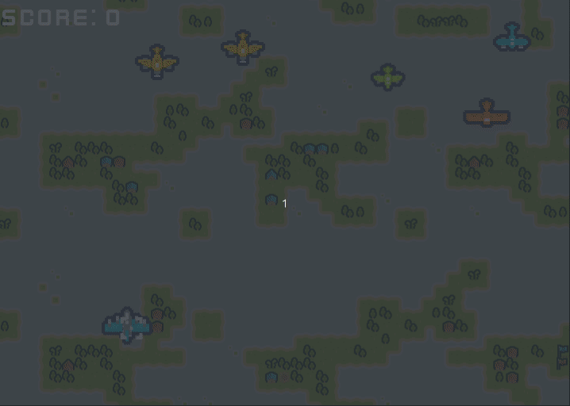

# Wars
Wars is a small game made with C, SDL 2, and Lua 5.3 to show Lua capabilities



# About
Wars game is played with the mouse moving the cursor around the screen and firing shots with a mouse click. The goal is to be an example for development with SDL 2 and Lua. It is a small game with infinite gameplay, you can press `ESC` to quit. It has some features like:
    
- Vector math in C
- Sprite, Font, Music, and SFX loading
- Independent game timing
- Simple animations
- Navigation grid for enemy movement
- Collision detection
- Random background scrolling
- Lua for scripting:
    - Access to vector and rect structures with arithmetic operations
    - Exposing custom libraries to Lua like drawing, sound, and fonts   
    - Calling script main functions to expose SDL events like mouse down, key press, etc
    - Loading settings from a Lua script

# What you can learn about Lua

This repository is used in an article on my blog, [Game Development with Lua
](https://lucasklassmann.com/blog/2023-10-20-game-development-with-lua-and-c), 
in that article I explain in detail how some features from Lua were used in which case.
You will find more examples than those mentioned. Here are some of the things you can find: 

- Expose variables
- Expose functions
- Call Lua function and pass arguments
- Customize Lua path search for loading scripts
- Read integers, booleans, strings, and tables from a script
- Expose complex user data from C to Lua with complex operations using metatables
- Receive optional arguments in a C function call from Lua
- Return multiples arguments to Lua when calling a C function
- Receive the user data from Lua and check its metatable
- Create custom modules in C that can be imported in Lua with require
- Expose tables with fields and methods to Lua

## Dependencies

- [CMake >= 2.8.12](https://cmake.org/download/)
- [Lua 5.3](https://www.lua.org/download.html)
- [SDL 2](https://www.libsdl.org/)
    - [SDL 2 TTF](https://github.com/libsdl-org/SDL_ttf)
    - [SDL 2 Mixer](https://github.com/libsdl-org/SDL_mixer)
    - [SDL 2 Image](https://github.com/libsdl-org/SDL_image)

Installation depends on the platform, in Ubuntu Linux:
```
sudo apt install libsdl2-dev libsdl2-ttf-dev libsdl2-image-dev libsdl2-mixer-dev liblua5.3-dev lua5.3 cmake
```


# Assets
Most of the assets used are from the great free assets of [Kenney.nl](https://www.kenney.nl).


# License
[Apache 2.0](LICENSE)